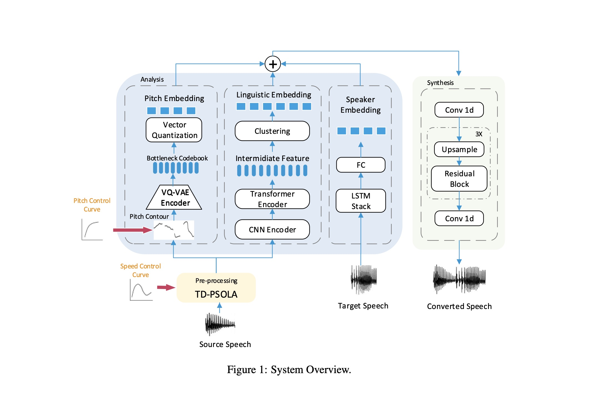

# ControlVC: Zero-Shot Voice Conversion with Time-Varying Controls on Pitch and Rhythm
This is the implementation of our paper: "ControlVC: Zero-Shot Voice Conversion with Time-Varying Controls on Pitch and Rhythm" by Meiying Chen and Zhiyao Duan.



**Paper link:** https://arxiv.org/abs/2209.11866

**Demo page with audio samples:** https://bit.ly/3PsrKLJ


## Usage

**A detailed example can be found in `inference.sh`**

### Setup
- Install Python >= 3.6
- Run `pip install -r requirements.txt`
- Download all pre-trained checkpoints and put under `checkpoints` directory.

### Prepare data for voice conversion
1. Create a folder for each speaker and put all the samples uttered by this speaker under one folder.
2. Trim, pad and using TD-PSOLA to modify prosody. 
```
python3 scripts/preprocess.py \
    --srcdir $WAV_DIR_IN \
    --outdir $WAV_DIR_PROCESSED \
    --postfix $EXT \
    --pad --keepfolder \
    --rhythm_cruve
```


### Extract and parse HuBERT code
```
python3 infer_hubert.py \
    --feature_type hubert \
    --kmeans_model_path ${CKPT_DIR}/km.bin \
    --acoustic_model_path ${CKPT_DIR}/hubert_base_ls960.pt \
    --layer 6 \
    --wav_path $WAV_DIR_PROCESSED \
    --out_quantized_file_path $OUT_QUANTIZED_FILE \
    --extension $EXT

python3 scripts/parse_hubert_codes.py \
    --codes $OUT_QUANTIZED_FILE \
    --manifest ${MANI_DIR}/wavlist.txt \
    --outdir $MANI_DIR \
    --all-test
```
### Extract and parse speaker embedding
```
python3 scripts/extract_mel4spkembd.py \
    --wavdir $WAV_DIR_PROCESSED \
    --meldir $MEL_DIR \
    --ext $EXT

python3 infer_spk_embd.py \
    --srcdir $MEL_DIR \
    --outdir $MANI_DIR \
    --checkpoint_path ${CKPT_DIR}/3000000-BL.ckpt \
    --num_utts -1 \
    --len_crop -1

python scripts/parse_spk_embed.py \
    --embed_file ${MANI_DIR}/spk_embed.pkl \
    --manifest ${MANI_DIR}/test.txt \
    --outdir $MANI_DIR
```

### Get speaker statistics (optional)
```
python scripts/get_f0_stats.py \
    --srcdir $WAV_DIR_PROCESSED \
    --outdir $MANI_DIR
```

### Pitch control and audio generation
```
python infer_main.py \
     --input_code_file ${MANI_DIR}/test.txt \
     --checkpoint_file ${CKPT_DIR}/embed_f0stat2 \
     --output_dir $OUT_DIR \
     --f0_stats ${MANI_DIR}/f0_stats.pkl \
     --spk_embed ${MANI_DIR}/spk_embed.pkl 
```


## Pretrained Models
Please download checkoints from this link:

https://drive.google.com/drive/folders/1APVHQFIb1871UhvymdK_oewWKJWrInYK?usp=sharing

In the folder:
| Model | Checkpoint |
| ----------- | ----------- |
| speaker embedding model | 3000000-BL.ckpt |
| huert model|hubert_base_ls960.pt|
|hubert k-means quantizer|km.bin|
|f0 quantizer|vctk_f0_vq|
|main voice conversion model|embed_f0stat2|

## Train from Scratch
### Training VQ-VAE F0 model
1. Preprocess data (trim and pad)
```
python3 scripts/preprocess.py \
    --srcdir $WAV_DIR_IN \
    --outdir $WAV_DIR_PROCESSED \
    --postfix $EXT \
    --pad 
```
2. Traning
```
python3 train_f0_vq.py \
--checkpoint_path checkpoints/debug \
--config configs/f0_vqvae.json
```
### Training main voice conversion model
1. Preprocess your own datasets using all steps in inference except the `infer_main.py`, which includes:
    -  preprocess (trim and pad)
    -  extract and parse HuBERT code
    -  extract and parse speaker embedding
    -  get f0 stats (optional)
2. Training
```
python3 train_main.py \
--checkpoint_path checkpoints/debug \
--config configs/hifigan.json
```

## Citation
To cite this paper or repo, please use the following BibTeX entry:
```
@article{chen2022controlvc,
    title={ControlVC: Zero-Shot Voice Conversion with Time-Varying Controls on Pitch and Rhythm},
    author={Chen, Meiying and Duan, Zhiyao},
    journal={arXiv preprint arXiv:2209.11866},
    year={2022}
}
```

## Acknowledgements
This project in based on the following repos (in alphabetic order):
- [auspicious3000/autovc](https://github.com/auspicious3000/autovc)
- [facebookresearch/speech-resynthesis](https://github.com/facebookresearch/speech-resynthesis)
- [facebookresearch/fairseq](https://github.com/facebookresearch/fairseq)
- [jik876/hifi-gan](https://github.com/jik876/hifi-gan)
- [openai/jukebox](https://github.com/openai/jukebox)

We appreciate those authors for their generous contribution!

## License
Please refer to LICENSE.txt for details.